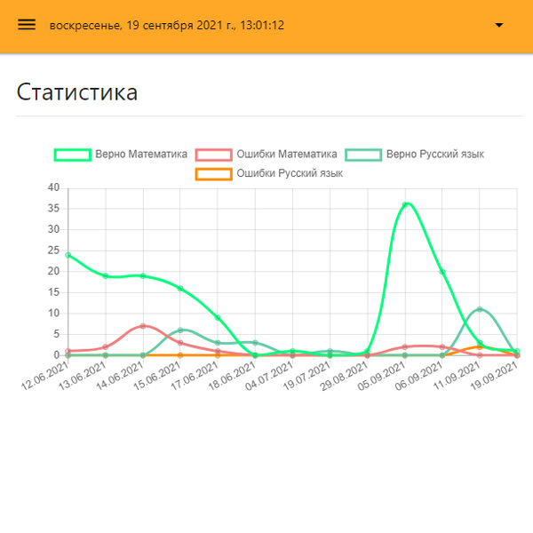
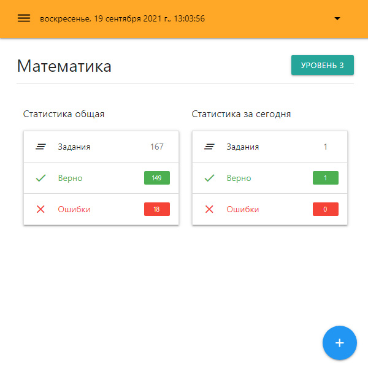
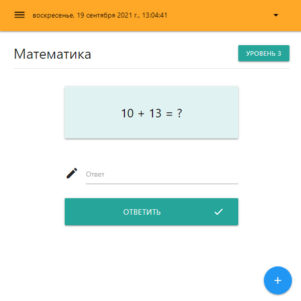
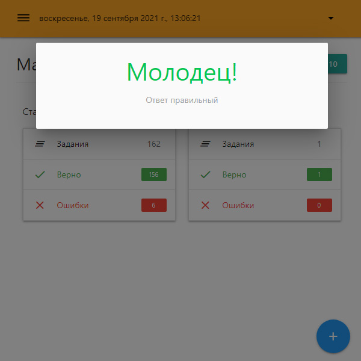
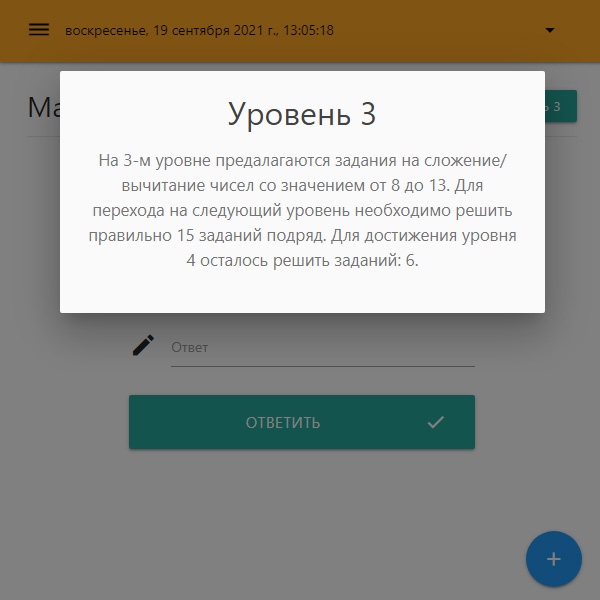
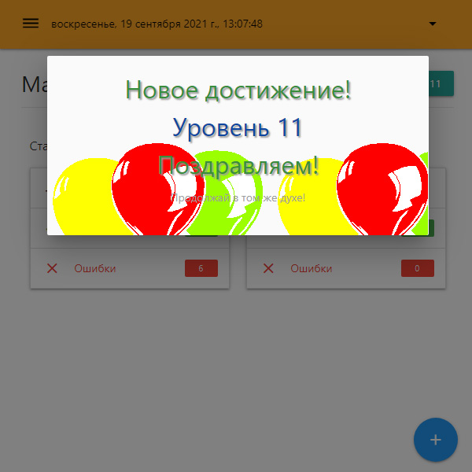
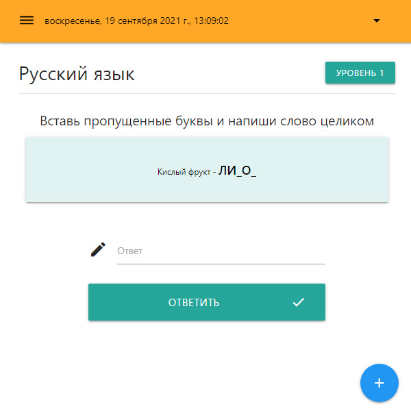

# SmartKids

Занятия по математике и русскому языку для дошкольников.

## Стэк

Vue3 + Node + MongoDB

## Как запускать?

1. `npm run install_modules` - установка необходимых пакетов
2. `npm run launch_app_dev` - запуск в режиме разработки

**Для успешного запуска требуются файлы переменных окружения `.env`**

Шаблоны файлов: `/ui/.env.example`, `/api/.env.example`

Приложение работает на следующих портах:
- http://localhost:8080/  – Frontend
- http://localhost:3000/  – Backend

## Принтскрины

<kbd></kbd>

<kbd></kbd>

<kbd></kbd>

<kbd></kbd>

<kbd></kbd>

<kbd></kbd>

<kbd></kbd>

## Описание проекта

### Frontend

Проект работает с применением Vue Router, Vuex на "фронтенде". Входная точка – модуль "Авторизация/Регистрация". Валидация введенных пользователем данных – библиотека Vee-Validate.

В личном кабинете 3 раздела:

- Статистика
- Математика
- Русский язык

На странице статистики реализован вывод графика истории решения заданий (библиотека Vue-Chartjs).

На страницах предметов реализован краткий вывод статистики по решенным заданиям за сегодня и за все время, выводится текущий "уровень", показываются новые задания.

### Backend

На "бэкенде" реализована вся логика по генерации заданий. Дополнительно проверяются и валидируются входные данные, пришедшие с форм "фронтенда" ("express-validator"). Реализована проверка токена авторизации с использованием "jsonwebtoken". Роутинг ендпойнтов API реализован посредством фреймворка "Express".

Приложение имеет продуманную структуру достижения новых уровней. Например, по математике на "нулевом" уровне предлагаются простейшие задания на сложение/вычитание цифр. Для перехода на следующий уровень необходимо решить правильно 5 заданий подряд. Далее на следующих уровнях сложность заданий повышается: предлагается складывать/вычитать три числа, добавляются новые операции (умножение/деление). При достижении нового уровня ребенок видит поздравительную анимацию – воздушные шарики.
